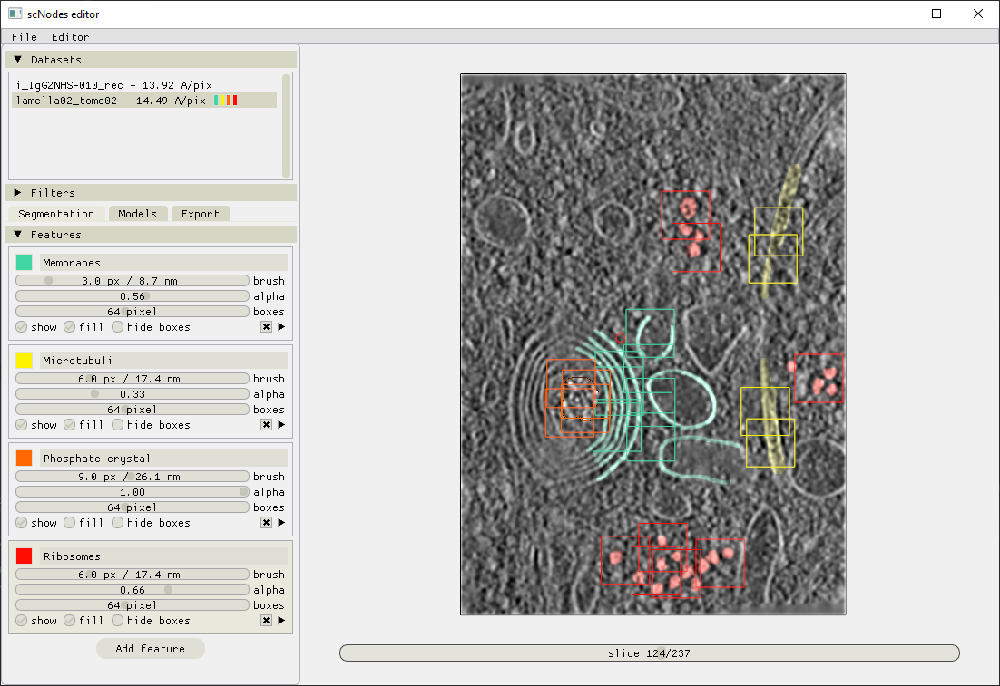
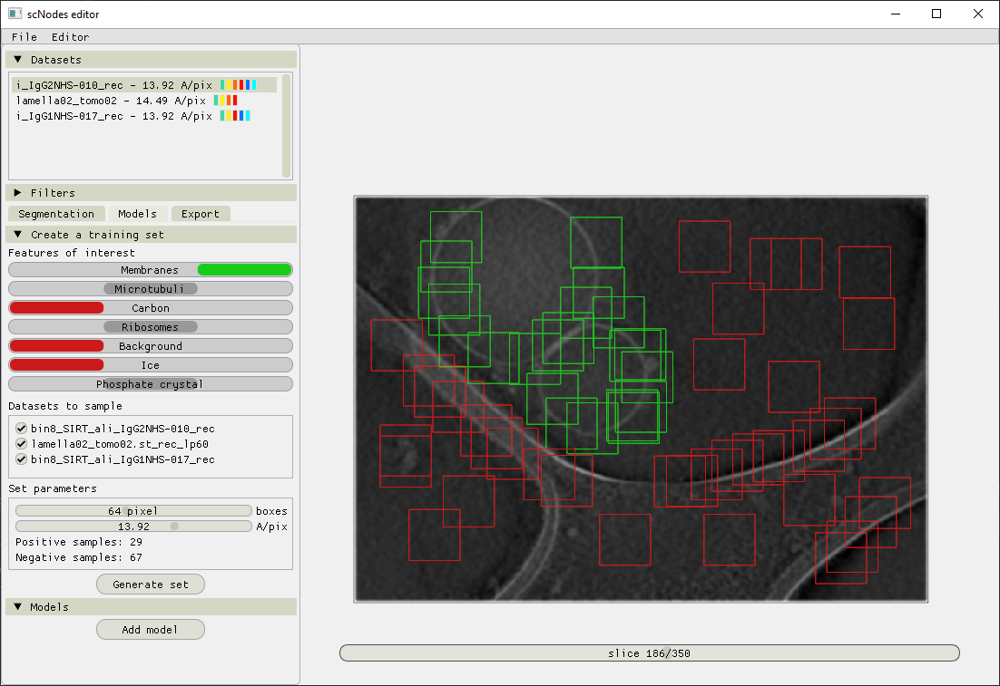
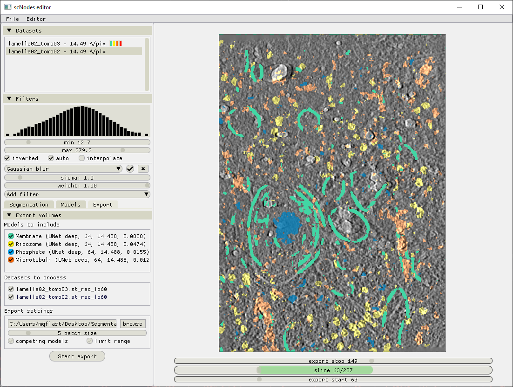

# scSegmentation #
## Fast and user-friendly annotation and segmentation of cryo-electron tomography data using convolutional neural networks ##

This repository comprises a standalone pre-release of the scNodes _Segmentation Editor_. For the full project, see our repository at github.com/bionanopatterning/scNodes

A time-lapse video of the full workflows, from reconstructed tomograms to segmented volumes showing membranes, ribosomes, phosphate crystals, and microtubuli, is available here: https://youtu.be/9z8OK8k4578

Contact: m.g.f.last@lumc.nl

### Annotation ###

### Generating training sets ###

### Training models ###

## Exporting segmented volumes ###
