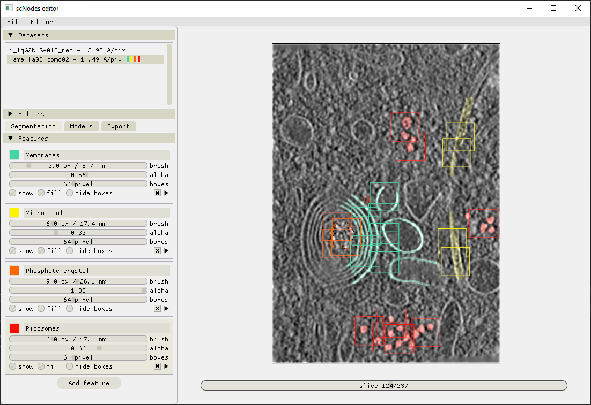
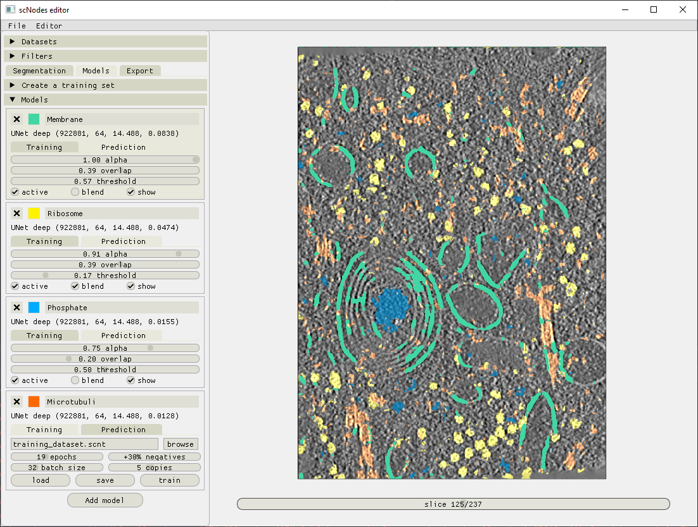
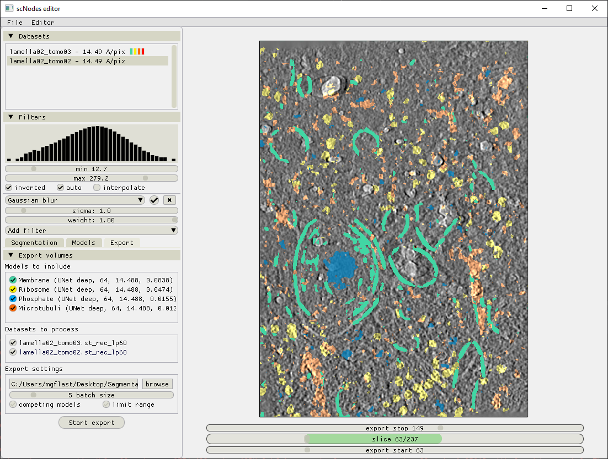

# scSegmentation #
## Fast and user-friendly annotation and segmentation of cryo-electron tomography data using convolutional neural networks ##

This repository comprises a standalone pre-release of the scNodes _Segmentation Editor_. For the full project, see our repository at github.com/bionanopatterning/scNodes

A timelapse video of the full workflow, from reconstructed tomograms to segmented volumes showing membranes, ribosomes, phosphate crystals, and microtubuli, is available here: https://youtu.be/9z8OK8k4578

Contact: m.g.f.last@lumc.nl

### Installation ###
Compatibility between Python, tensorflow, and CUDA versions can be an issue. The following combination was used during development and is know to work:

Python 3.9
Tensorflow 2.8.0
CUDA 11.8
cuDNN 8.6
protobuf 3.20.0

The software will work without CUDA, but only on the CPU. This set up is much slower but still reasonably interactive. We do recommend installing CUDA and cuDNN in order for tensorflow to be able to use the GPU. 

### Annotation ###

### Generating training sets ###

### Training models ###

## Exporting segmented volumes ###

