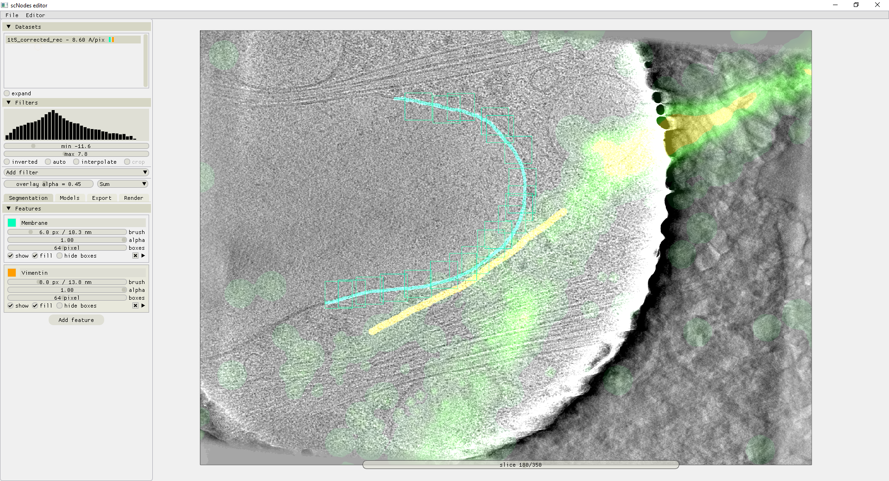

[](https://github.com/bionanopatterning/Ais/blob/master/Ais/LICENSE.txt)
[](https://pypi.org/project/Ais-cryoET/)
[](https://ais-cryoet.readthedocs.io/en/latest/?badge=latest)


# Segmentation with Ais #
## Fast and user-friendly annotation and segmentation of cryo-electron tomography data using convolutional neural networks ##

This repository comprises a standalone version of Ais, the segmentation editor for cryoET. For the version integrated into the correlative microscopy data processing suite _scNodes_, see the [scNodes](https://www.github.com/bionanopatterning/scNodes) repository.

A timelapse video of the full workflow, from reconstructed tomograms to segmented volumes showing membranes, ribosomes, mitochondrial granules, and microtubuli, is available on our [YouTube channel](https://www.youtube.com/watch?v=2JIBVJf3kYQ&ab_channel=scNodes).

Contact: mlast@mrc-lmb.cam.ac.uk

### Installation ###
Ais works on Windows and Linux machines but not on MacOS. Install as follows: 
```
conda create --name ais
conda activate ais
conda install python==3.9
conda install pip
pip install ais-cryoet
```

Then run using either of the following commands:
```
ais
ais-cryoet
```
#### Tensorflow & CUDA compatibility ####
Compatibility between Python, tensorflow, and CUDA versions can be an issue. The following combination was used during development and is known to work:

Python 3.9<br/>
Tensorflow 2.8.0<br/>
CUDA 11.8<br/>
cuDNN 8.6<br/>
protobuf 3.20.0<br/>

The software will work without CUDA, but only on the CPU. This is much slower but still reasonably interactive if the tomograms aren't too big (in XY). We do recommend installing CUDA and cuDNN in order for tensorflow to be able to use the GPU. See: https://docs.nvidia.com/deeplearning/cudnn/install-guide/index.html for help installing CUDA and cuDNN. 

## Gallery ##
### Annotation ###

In this example, four features (membranes, microtubuli, mitochondrial granules, and ribosomes) are concurrently annotated. 

### Generating training sets ###

After preparing some annotations, the user in this example selects positive and negative features before compiling a training dataset for a network that will learn to recognize lipid membranes.

### Training models ###

Here, four previously prepared training datasets are used to train four segmentation models. The menu on the left shows the set-up for the four models; the first three models have already been trained, while the fourth (microtubuli, orange) is being set up for a second training run.

### Model interactions ###

Model interactions add an extra layer of nonlinear filtering to the model outputs, and can aid significantly in reducing false positive predictions. Here, competition between the single and double membrane models enhances the differentiation between these two (similar) features, and a colocalization dependency of the viral pore model conditioned on the double membrane model suppresses spurious false positives by the pore model near biologically non-relevant other features.  

## Exporting segmented volumes ###

An example of the batch processing interface, in the 'Export' tab. Only one tomogram is imported, but any number can be linked into the software and processed in one go (typically, in an overnight process). Six features are being segmented: ribosome, coronaviral replication organelle pores, double membranes, intermediate filaments, microtubuli, and actin filaments.  

## Built-in rendering to inspect results ## 

After processing a volume, the resulting segmented volume datasets are automatically available in the 'Render' tab, where the segmentation results can be interactively viewed. Opening the results in more familiar suites such as Blender or ChimeraX is facilitated in the bottommost 'Export 3D scene' tab.

## Fluorescence-guided segmentation ##

In [scNodes](github.com/bionanopatterning/scNodes) + Ais, data can be forwarded from the correlation editor into Ais's segmentation editor. In the above image, a tomogram overlayed with a single molecule fluorescence localization map of rsEGFP2-labelled vimentin is being segmented; the fluorescence localizations reveal the location of vimentin filaments surrounded by a bundle of actin filaments an microtubules.

## 3D ray-traced fluorescence overlays ## 

Rendering in [scNodes](github.com/bionanopatterning/scNodes) + Ais combines the default isosurface viewer with 3D ray-traced fluorescence overlays. Here, a 2D single molecule localization map is projected into the 3D volume of the tomogram. Membranes, ribosomes, and the two vimentin filaments revealed by the fluorescence overlay are segmented and rendered.  