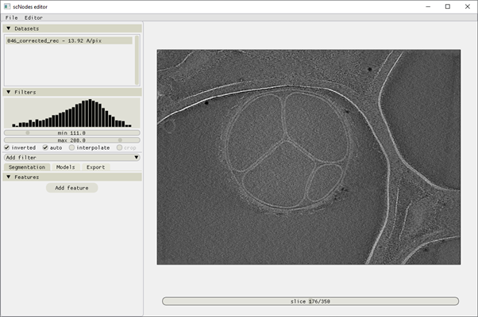
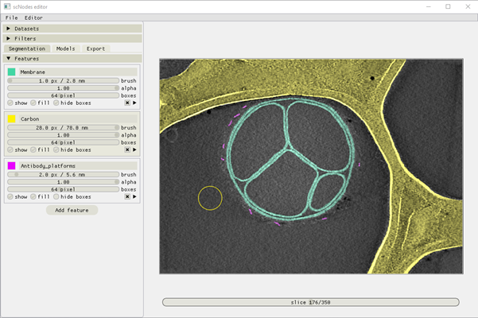
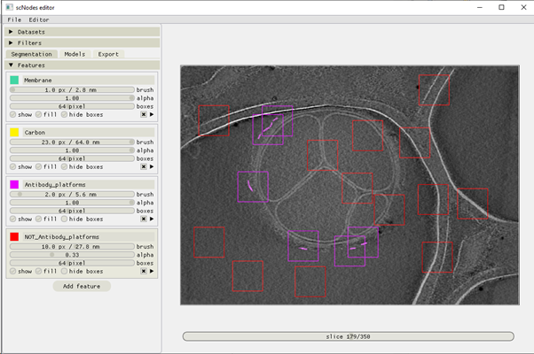
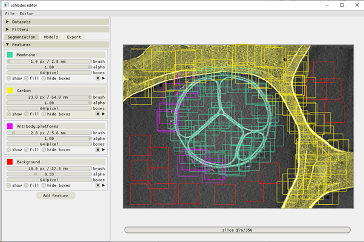

Annotation
__________

Overview of the user interface
^^^^^^^^^^^^

Segmenting tomographic volumes comprises a number of processing steps: i) manual annotation, ii) training neural networks, iii) applying the neural networks to the volumes. For each of these steps, a slightly different interface is available. After starting the software and importing a dataset (either by dragging a file and dropping it onto the scSegmentation window, or via the top menu bar File -> Import dataset, the interface looks as follows:

   Figure 1 – the user interface upon starting the software and importing a single tomogram.

The panel on the left is the main part of the user interface. From top to bottom, the panels provide the following functionality:

**Datasets**: select which dataset to edit or process. When multiple datasets are worked on at the same time, the datasets panel also provides an overview of which features have been annotated in which volumes.

**Filters**: adjust the visualization settings of the data. Change contrast limits, invert grayscale, toggle interpolation, and crop the volume. Various filters (e.g. Gaussian, Sobel, etc.) can be applied and adjusted on the fly and are computed on the GPU so that the processing cost is negligible. Filters are for the human eye only – the neural networks ignore them and do not need them.

**Segmentation / Models/ Export tabs**: toggle these tabs to switch between the segmentation, model configuration and testing, and the batch processing and export interfaces. Each of these will be explained in the following sections of the manual.

Drawing annotations
^^^^^^^^^^^^
The segmentation interface contains a single panel: ‘Features’. A feature is an annotation of a particular structure of interest, such as membranes, ribosomes, microtubules, etc.

To prepare an annotated ground-truth dataset to train neural networks with, we manually annotate a small section of the data.

For this example, we’ll prepare the annotation as seen in Figure 2 in the main text of the original publication of Ais.

Use the ‘Add feature’ button to set up a three features: membrane, carbon, and antibody platform, as below.

   Figure 2 – the user interface in the ‘Segmentation’ stage, with three features set up and annotated.

In the above image, the ‘carbon’  feature, with the highlighted panel, is the currently activated feature. The brush, with which annotations are drawn, can be seen as a yellow circle overlayed on the image. The membrane, lacey carbon, and antibody platforms have already been annotated. The drawing controls are as follows:

+--------------------------+----------------------------------------------+
| **Draw**                 | left mouse button                            |
+--------------------------+----------------------------------------------+
| **Erase**                | right mouse button                           |
+--------------------------+----------------------------------------------+
| **Move view**            | middle mouse button + drag cursor            |
+--------------------------+----------------------------------------------+
| **Zoom view**            | scroll + hold SHIFT                          |
+--------------------------+----------------------------------------------+
| **Change brush size**    | hold CTRL & scroll mouse wheel               |
+--------------------------+----------------------------------------------+
| **Browse slices**        | scroll mouse wheel or left/right arrow keys  |
+--------------------------+----------------------------------------------+
| **Place box**            | left mouse button while holding SHIFT        |
+--------------------------+----------------------------------------------+
| **Remove box**           | right mouse button while holding SHIFT       |
+--------------------------+----------------------------------------------+
| **Set active feature**   | click it in the Features panel, or use the   |
|                          | W/S keys                                     |
+--------------------------+----------------------------------------------+
| **Set active tomogram**  | up/down arrow keys                           |
+--------------------------+----------------------------------------------+

Placing boxes
^^^^^^^^^^^^
After annotating features, boxes must be placed to select which regions of the image to use for the training datasets. An example is shown below.

   Figure 3 – placing positive and negative boxes for the antibody platforms segmentation.

In order for a neural network to be able to learn to accurately distinguish between the intended feature of interest, and other, possibly similarly looking, features, it is important to select positive boxes as well as negative boxes. In the example above, we’ve placed 6 positive boxes as well as a number of negative boxes: boxes that contain no annotation for the antibody platforms and that do not contain antibody platforms either.

For the test results shown in Figure 2 of the article, we used the boxes and annotations shown below. We had labelled membrane and carbon film in only one slice, and antibody platforms in some more as there were few visible in any single slice. We additionally used a feature called ‘Background’ to pick boxes in which none of the three features of interest were visible.

   Figure 4 – The annotations and boxes used to generate the models discussed in main text figure 2.

Manual particle picking and segmentation
^^^^^^^^^^^^
scSegmentation can also be used for manual particle picking. By hovering the ‘>’ icon in the bottom right of every feature panel, a menu opens in which annotated slices are listed, and from where some files can be exported: i) tab-separated coordinates .txt files, ii) single annotations can be saved as a 2D .mrc file, and iii) a full annotated volume can be exported as a 3D .mrc file.

