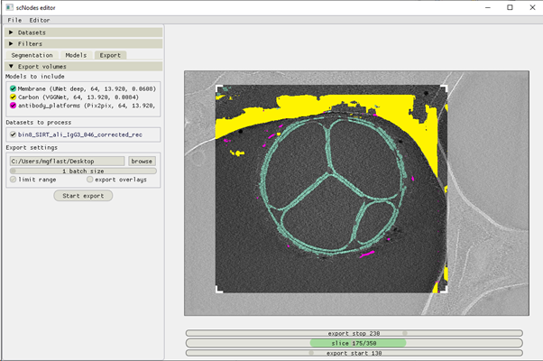

Batch processing
__________

Once the models have been set up and trained to a point where they work well, you can batch-process any amount of tomograms you’d like.

By cropping tomograms and limiting the depth range of interest (see image below), the processing speed can be increased significantly.

Note that cropping does not affect the size of the output. Segmentation .mrc files always have data with the same shape as the original input tomogram. This ensures that pixel locations are not shifted between tomogram and segmentation.

   Figure 9 – the interface in the ‘Export’ stage. The ‘limit range’ option is selected, and the depth range of interest has been set using the sliders above and below the slicer (bottom of the window).

An export job can always be cancelled, by pressing the 'x' button next to the progress bar that appears when launching the job.

