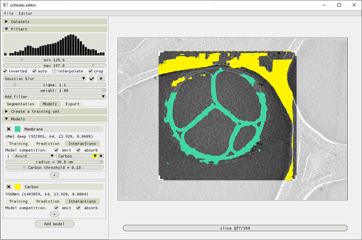

Creating models
__________

Creating training datasets
^^^^^^^^^^^^
Once we’re satisfied with the manual annotations and training boxes, the next step is to extract training datasets. This usually takes just a few seconds.

Switch in to the ‘Models’ tab. Two panels are now available: 1) Create a training dataset, and 2) Models

Open the ‘Create a training dataset’ panel, and select which features you want to use as positives and which as negatives. For example, for the membrane training dataset, move the slider for ‘Membrane’ to the right – it becomes green, indicating it is selected as a positive label, and move the ‘Background’ slider to the left – it becomes red, and has been selected as a negative label.

The neural networks used in scSegmentation perform single-feature semantic segmentation. So, for any feature of interest you want to build a segmentation network for, you’ll need to set up one training dataset. In other words: if you generate one training dataset with the membrane, carbon, and antibody platform features all set to be included as a positive, you’ll end up with a model that segments all these features as if they’re a single thing – it will not be able to distinguish membrane from carbon or antibodies.

Notice that you can sample from multiple datasets. If you had imported, e.g., ten tomograms into scSegmentation and manually labelled a feature called ‘Antibody platforms’ in all ten of them, you could now have selected all ten tomograms under the ‘Datasets to sample’ field and generated a single dataset that spans multiple volumes. This can be quite useful when working with a large dataset that isn’t entirely homogenous in terms of image quality; including multiple volumes in the training data helps obtain models that generalize better.

   Figure 5 – Creating a training dataset for a membrane-segmenting model.

Although box sizes can also be set when placing boxes in the ‘Segmentation’ stage, the actual box size used for training datasets is specified at this point (the boxes rendered in the segmentation stage are a guide to the eye). The pixel size can also be adjusted. Using a pixel size that is different than that of the actual data is possible, but usually it is best not to change pixel sizes too much, as interpolation artefacts can affect the output of neural networks significantly.

Training datasets are saved with the ‘.scnt’ extension (t for ‘training dataset’), but are actually just tiff files. They can be opened in ImageJ for inspection.

Training models
^^^^^^^^^^^^

Collapse the ‘Create a training dataset’ header and open the ‘Models’ one. Add a model. Give it a name (right-click the name field to open a drop down menu with which you can select the name of any previously prepared annotation) and select which model architecture to use. The default model is VGGNet, which is a fast and usually sufficiently accurate one.

In the ‘Training’ tab of the model, click the ‘browse’ button and find and open the previously generated training dataset. By default, the filenames of training datasets and models begin with something like ’12.34_64_...’. The first number is the pixel size, in Å per pixel, and the second is the box size. By training a model on a dataset with a particular box size, that box size also becomes the box size of the model – it can not be changed afterwards. The box size of the model determines the size of the images that the model can process. When processing an entire slice, the slice is chopped up into square images with that box size. These images are then processed individually, after which the resulting segmentation images are tiled back into the shape of the original image. More about this later.

Four training parameters can be specified:

1)	*The number of epochs* – this is the amount of times that the neural network processes the entire dataset during training. A good starting value is 25. With too few epochs, the model won’t learn as effectively as with more, but with too many epochs overfitting or vanishing or exploding gradients may become a problem.

2)	*The ratio of negatives* – this value determines how many negative images will be included in the training data for every one positive image. The default value is +30%, meaning 1.3 negative images are samples for every 1 positive.

3)	*The batch size* – parameters of the neural network are updated after processing one batch. A useful thread on the meaning of the batch size can be found here: https://stats.stackexchange.com/questions/153531/what-is-batch-size-in-neural-network - the default value of 32 is usually fine.

4)	*The number of copies* – positive images in the raw training dataset are samples multiple times and in random orientations, in order to enhance the generalizability of the data. The number of copies dictates how often each input positive is sample. In case the training dataset contains, e.g., 50 positives and 200 negatives, and the excess negative rate is +100%, at least 2 copies are required to make full use of the training data: there would then be 2 * 50 = 100 positive images, and 100 * (100% + 100%) = 200 negatives. Any fewer copies or lower negative ratio would mean that not all negative images are utilized.

   Figure 6 – the ‘training’ tab of the model interface. Above is the menu before compiling the model, below is the interface as seen during training and after model compilation. Instead of the model selection drop down menu, an info string is displayed with the following format: model name (number of parameters, box size, pixel size, loss value)

**Training runs can always be interrupted. After training, models can be saved for later re-use.**

Models are saved as ‘.scnm’ files (m for ‘model’) and as ‘.h5’ files. The ‘.scnm’ files are what scSegmentation needs to be able to load a model, and the ‘.h5’ files contain the model parameters as saved by tensorflow.keras. These two files should be kept in the same directory.

Using models
^^^^^^^^^^^^

Models are applied to volumes on a slice-by-slice basis. As mentioned before, slices are chopped up into boxes of some size, then processed, then detiled back into the original image shape.

This tiling process is governed by a parameter: the overlap. By default, the overlap is 0.2.

The output of a model is an image with pixel values in the range 0.0 – 1.0, which indicate the prediction strength. In scSegmentation, model outputs are rendered as binary mask overlays, which are computed with some adjustable threshold.

Using the ‘save’ button in the model panel’s ‘Prediction’ tab, a single 2D .mrc image containing the currently visible segmentation can be exported.

The ‘active’ checkbox can be used to temporarily (de)activate models.

   Figure 7 – a view of the user interface in the ‘Models’ stage. A single model, segmenting membranes, was set up and briefly trained. Its output is rendered on top of the original image.

*By default, full slices are processed. Specifying a smaller region of interest is also possible; either check the 'crop' box in the Filters menu, or press the C key. Crop markers will appear, which can be moved to specify the area of interest. By cropping out a smaller region, browsing the volume and real-time segmentations can be made a bit faster, should the full images take too long to process.*

Model interactions
^^^^^^^^^^^^
The third tab in the model panel, ‘Interactions’ can be used to set up interactions between differentmodels. To demonstrate, we’ve added a second model (carbon), and added an interaction to the membrane model, telling it to avoid carbon within 30.0 nm. We’ve also told both models to emit and absorb competition. Models that absorb competition are suppressed to 0.0 whenever there is any emitting model that predicts a higher value for the same pixel.

   Figure 8 – model interactions. We’ve set the threshold of the membrane model and the interaction to a low value to demonstrate the carbon avoidance a bit better. Notice that we’ve also activated the ‘crop’ function in the ‘Filters’ panel, and set the crop range such that only the interesting region of the image (that which actually contains membrane) is processed. This significantly increases the on-the-fly processing speed and thus also the framerate of the software.

