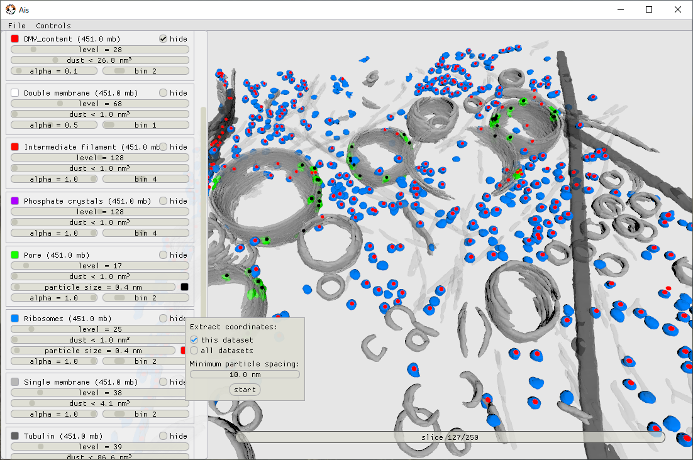
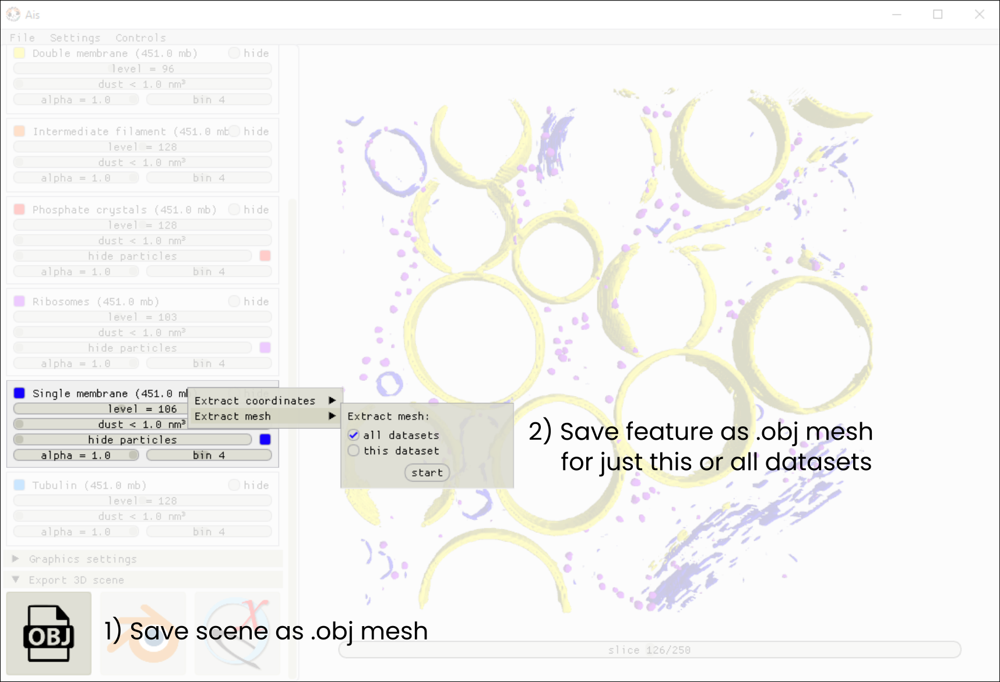

Extracting particle coordinates and meshes
----------

Particle picking
^^^^^^^^^^^^^^

The text below describes how to use the Ais GUI for picking. Instructions for using the cli tool instead can be found `here <https://ais-cryoet.readthedocs.io/en/latest/command_line_interface.html>`_.

Ais can automate particle picking. When rendering 3D models in the 'Render' tab, you can adjust certain parameters, such as the isosurface level and minimum particle size, to change how a segmented volume is rendered as a mesh in 3D. When doing so for a segmentation of, e.g., ribosomes, many distinct particles are usually visible within the volume of the tomogram. In such a case, the job of particle picking is simply to convert each of these visible particles into a coordinate.

The particle picking interface can be accessed by right-clicking any of the available volumes in the Render tab (press '4' on the keyboard to jump to this tab). Ais tried to automatically import segmented volumes that belong to the opened dataset, based on the filenames of the dataset and the segmentations. For instance, if the input .mrc is '.../data/TS_001.mrc' and a network named 'Ribosome' was used to segment ribosomes, the corresponding output file '.../data/TS_001__Ribosome.mrc' will automatically be opened when in the Render tab. If segmented volumes were saved to a different directory than the input data, you will have to select this directory first.

When a segmented feature is found, right click it's panel to open the particle picking mune, as in the image below:

   Figure 13 - Particle picking in Ais. A scene containing vesicles and some components of the cytoskeleton all rendered in grayscale, and two features of interest for particle picking in colour: molecular pores in the double membrane vesicles in green, overlayed with black dots that indicate the position of picked particles, and ribosomes in blue, with red dots indicating the coordinates of selected particles.

Behind the scenes, the procedure to convert the 3D grayscale data of a segmentation into a list of coordinates is based on watershedding and selecting resulting labelled regions based on certain criteria. For globular particles, like the pores and ribosomes in the above example, the result of this approach is straightforward and tends to be predictable. For more irregularly shaped particles, however, the result of ROI selection by watershedding can be less intuitive: it is not always the case that isolated, contiguous objects as seen in the isosurface rendering, are picked as one single coordinate. In these cases it can be convenient to run the extraction job for a single dataset only and inspecting the result before proceeding. By tweaking the 'minimum spacing' parameter, it is usually possible to get the desired result. Picking by means of watershedding is thus slightly more hands-on than picking based on thresholding, which is how the 3D renderer prepares models, but is also more versatile: picking by thresholding introduces the problem that in cases where, e.g., two ribosomes are touching, a single coordinate is picked at their center rather than two coordinates placed at the center of the individual ribosomes.

.. figure:: ./res/picking_2.png
   :class: with-border
   :align: center

   Figure 14 - Picking non-globular particles requires tweaking the 'minimum separation' parameter to avoid picking multiple coordinates for one particle.

Extracting meshes
^^^^^^^^^^^^

As an alternative to saving coordinates, rendered objects can also be saved as meshes. There are two ways of doing so: 1) saving a visible 3D scene as a single object file (e.g., render ribosomes, microtubuli, and membranes and export the three as a single .obj file), or 2) for a specific feature (e.g. ribosomes), meshes can be exported in batch-mode for all datasets open in the editor.

The first option is available in the Render tab under the 'Export 3D scene' header. Click the OBJ button to save the scene as a mesh (.obj file format), or the Blender or ChimeraX icons to open the scene in 3rd party editors (the path to the Blender and ChimeraX executables needs to be set in the top menu bar -> Settings -> 3rd party applications).

The second option is available in the same menu as particle picking: right-click any open feature in the Renderer and open the mesh extraction menu under 'Extract mesh'. Figure 15 shows the relevent parts of the GUI.

   Figure 15 - GUI for mesh extraction