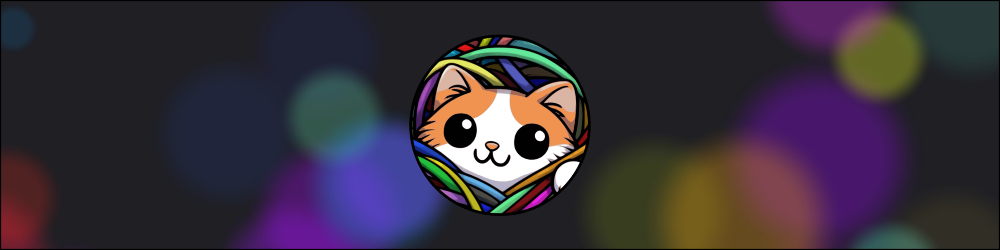
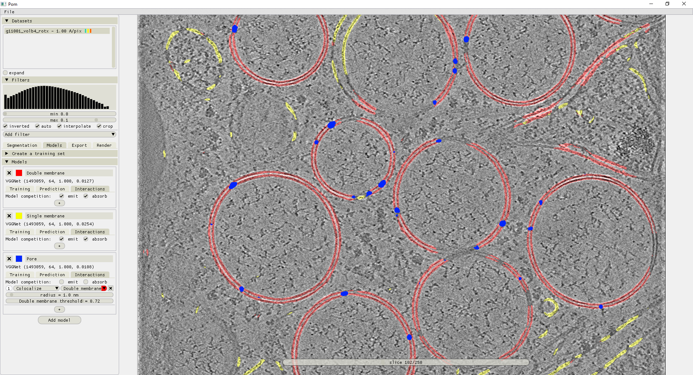

<h2 style="text-align: center; font-weight: bold;">Fast and user-friendly segmentation of cryo-electron tomography data</h2>
<h3 style="text-align: center; font-weight: bold; font-style: italic;">annotate, train, and apply convolutional neural networks</h3>

**Ais** is a segmentation suite for cryo-electron tomography data that was designed to be fast, intuitive, and as easy to use as we could make it. Manually annotate a small section of your data, train a neural network in seconds, and apply it to segment entire datasets.

<figure markdown="span">
  { .with-border }
</figure>

Watch the [video introduction to Ais](https://www.youtube.com/watch?v=ES4tsIt-DCQ&list=PL_lGdEIRskGb5-vwuuGN9QJZxRvvl44Zd) on YouTube.

## Ais ecosystem
This repository comprises a standalone version of Ais. For the version integrated into the correlative microscopy data processing suite **scNodes**, see the [scNodes](https://github.com/bionanopatterning/scNodes) repository. Trained models can be shared via the [Ais model repository](https://www.aiscryoet.org). Ais is also the foundation on which [easymode](https://mgflast.github.io/easymode/) - pretrained general networks for cellular cryoET - was built.

!!! tip "Need help?"
    Please post questions and bug reports on the [Ais GitHub issues page](https://github.com/mgflast/Ais/issues).
