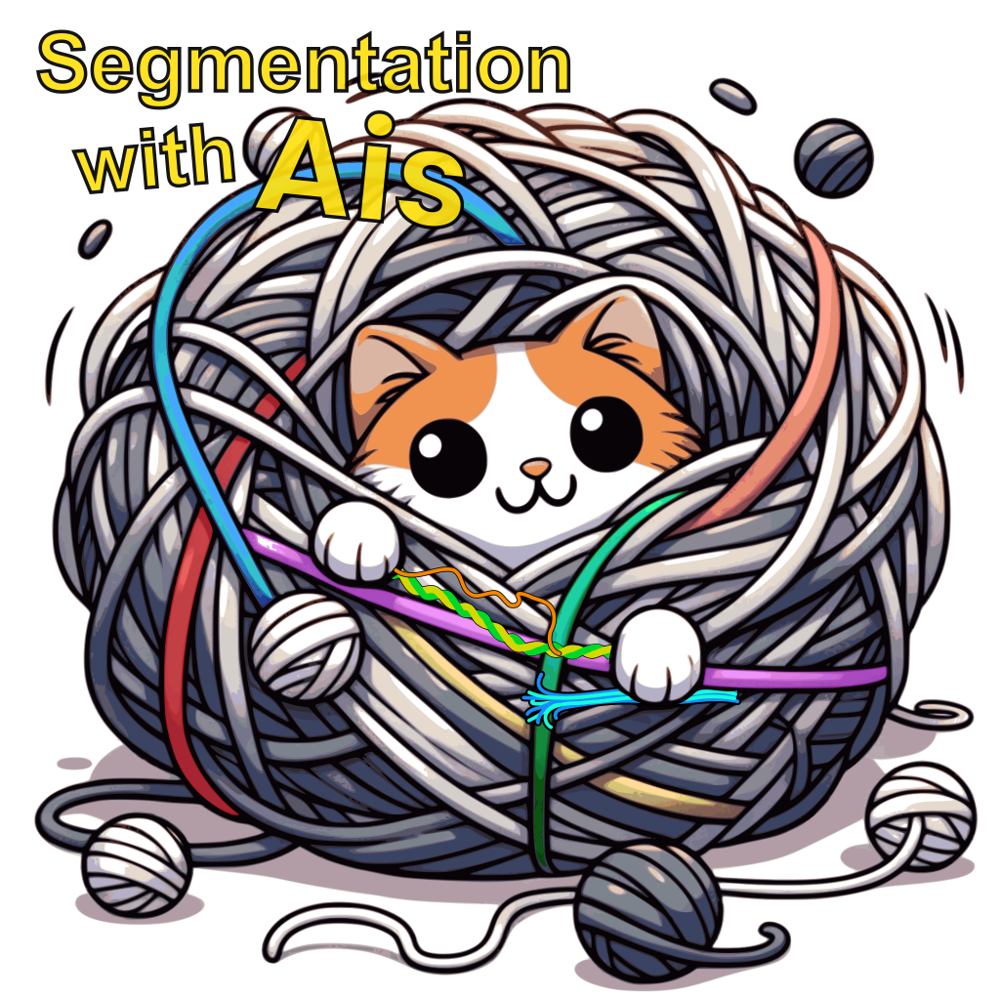
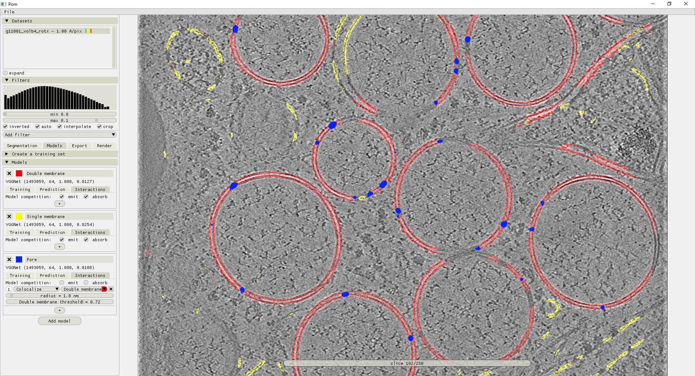

.. Ais documentation master file, created by
   sphinx-quickstart on Fri Oct 27 11:13:46 2023.
   You can adapt this file completely to your liking, but it should at least
   contain the root `toctree` directive.

Welcome to Ais' documentation!
===============================

Welcome to the user guide of Ais - a segmentation suite for cryo-electron tomography data that was designed to be fast, intuitive, and as easy to use as we could make it.

Click `here <https://www.youtube.com/watch?v=ES4tsIt-DCQ&list=PL_lGdEIRskGb5-vwuuGN9QJZxRvvl44Zd>`_ to watch the video introduction to Ais.

Table of contents
__________

.. toctree::
   :maxdepth: 2
   :caption: Contents:

   installation
   annotation
   creating_models
   batch_processing
   rendering
   python_module

Help
----------------

Need help? `Ask here <https://github.com/bionanopatterning/Ais/issues>`_ or reach out to m.g.f.last@lumc.nl
