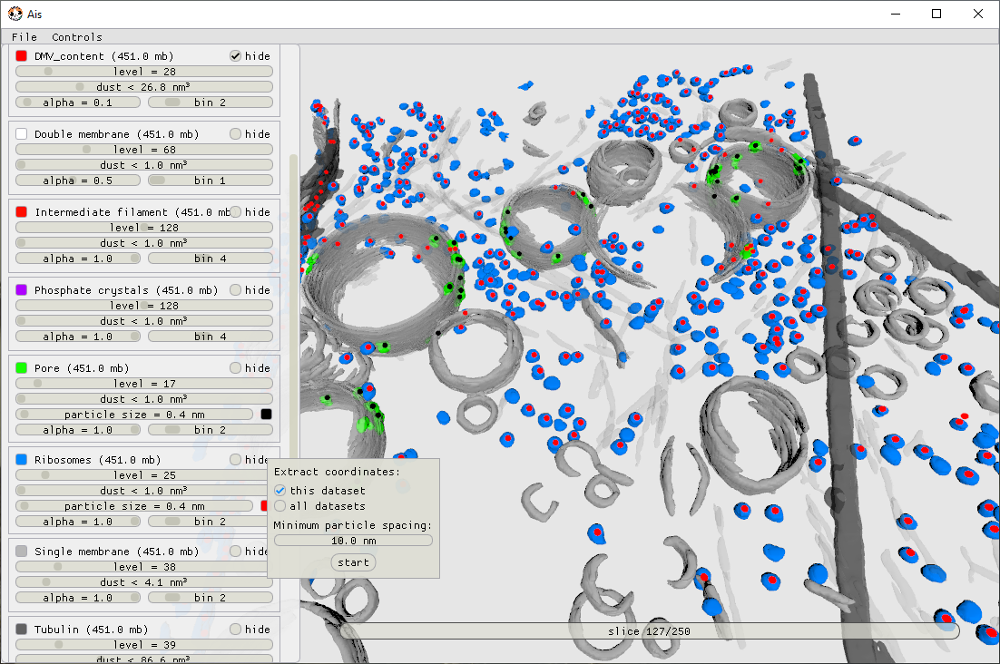
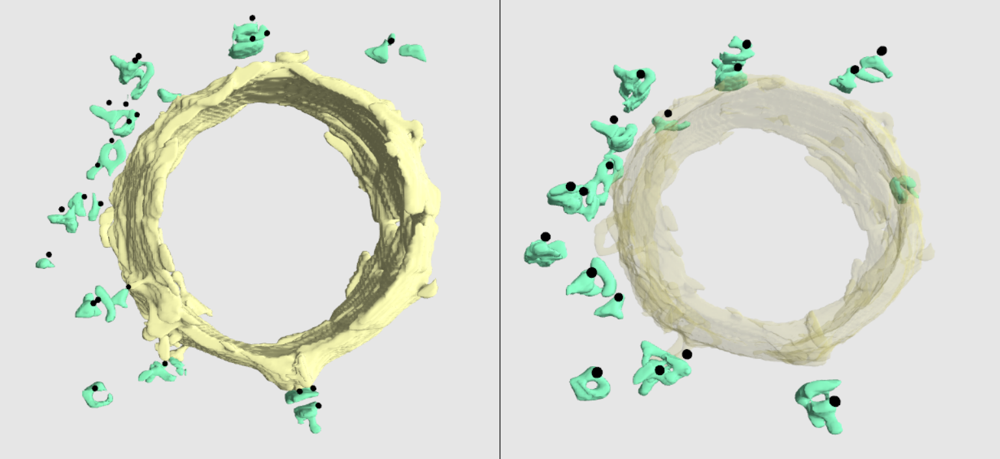

Particle picking
__________

Ais can automate particle picking. When rendering 3D models in the 'Render' tab, the user can adjust certain parameters, such as the isosurface level and minimum particle size, to change how a segmented volume is rendered as a mesh in 3D. When doing so for a segmentation of, e.g., ribosomes, many distinct particles are usually visible within the volume of the tomogram. In such a case, the act of particle picking is simply to convert each of these visible particles into a coordinate, which can subsequently be used to, for example, extract subvolumes from the dataset.

The particle picking interface can be accessed by right-clicking any of the available volumes in the Rendering -> Volumes tab. A menu appears, offering the option to pick particles in either the active dataset, or all linked datasets that have a segmentation for the chosen feature of interest available (change the directory in which files are searched for using the directory selection widget at the top of the 'Volumes' header)

   Figure 13 - Particle picking in Ais. A scene containing vesicles and some components of the cytoskeleton all rendered in grayscale, and two features of interest for particle picking in colour: molecular pores in the double membrane vesicles in green, overlayed with black dots that indicate the position of picked particles, and ribosomes in blue, with red dots indicating the coordinates of selected particles.

Behind the scenes, the procedure to convert the 3D grayscale data of a segmentation into a list of coordinates is based on watershedding and selecting resulting labelled regions based on certain criteria. For globular particles, like the pores and ribosomes in the above example, the result of this approach is straightforward and tends to be predictable. For more irregularly shaped particles, however, the result of ROI selection by watershedding can be less intuitive: it is not always the case that isolated, contiguous objects as seen in the isosurface rendering, are picked as one single coordinate. In these cases it can be convenient to run the extraction job for a single dataset only and inspecting the result before proceeding. By tweaking the 'minimum spacing' parameter, it is usually possible to get the desired result. Picking by means of watershedding is thus slightly more hands-on than picking based on thresholding, which is how the 3D renderer prepares models, but is also more versatile: picking by thresholding introduces the problem that in cases where, e.g., two ribosomes are touching, a single coordinate is picked at their center rather than two coordinates placed at the center of the individual ribosomes.

   Figure 14 - Picking non-globular particles requires tweaking the 'minimum separation' parameter to avoid picking multiple coordinates for one particle.