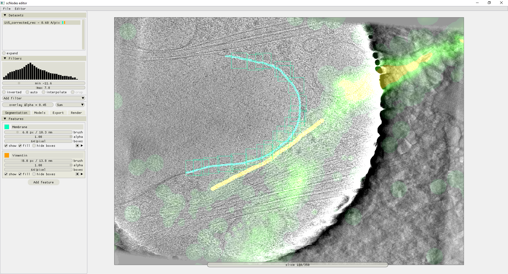
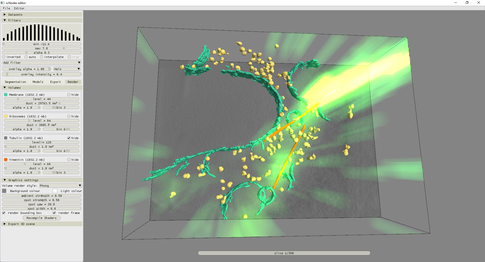

Rendering
__________

To facilitate inspecting segmentation results, Pom comes with a built-in isosurface renderer that is similar to the surface renderer in ChimeraX. As soon as an Export job has created a segmentation, these results are available in the 'Render' tab of the main menu.

By default, Pom looks for segmentation results in the same folder in which the original .mrc file is located. Specify a different directory by clicking the '...' button or editing the path in the 'Volumes' tab of the main menu.

.. figure:: ./res/render_1.png
   :class: with-border
   :align: center

   Figure 10 – Rendering segmentation results of 10 different models in the built in renderer.

3D models can be ported from Pom directly into ChimeraX, Blender, or saved using the .obj file format, using the buttons in the 'Export 3D scene' submenu.

In scNodes+Pom - the version of Pom integrated into our main superclem software suite, available at `github.com/bionanopatterning/scNodes <https://github.com/bionanopatterning/scNodes>`_, additional functionality is available to render fluorescence overlays in the segmentation editor. Tomograms with fluorescence overlays can be prepared in the scNodes' Correlation Editor and can be directly forwarded into Pom with a single button click. These overlays can then be consulted during every step of the segmentation workflow.

   Figure 11 – An example of scNodes+Pom, where we segment a correlated dataset of rsEGFP2-Vimentin single molecule localization fluorescence and cryoET. The fluorescence data guides the identification of vimentin filaments.

   Figure 12 – A 3D render of the same data as before, after segmenting ribosomes, membranes, and vimentin filaments. The (2D) fluorescence overlay is rendered using ray tracing and projection into the 3D volume of the tomogram.

