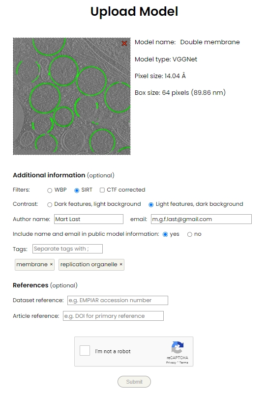

Sharing models
__________

Trained models can be shared via the `Ais model repository <https://www.aiscryoet.org>`_. Any .scnm file can be uploaded to the repository and will, after passing screening, become available for download.

The (.scnm) model filex exported by Ais are uncompressed .tar archives that contain a number of files:

* model_weights.h5: the model weights
* model_metadata.json: the model metadata, such as name, colour, alpha, etc.
* model_slice.tiff: an image used to test the model on. When saving a model, the then selected slice in the then selected tomogram is included as the test slice. This image is stored on the server that hosts the repository, but is removed from the file before it is made publically available.
* model_preview.png: a preview image to be displayed on the website. This file is also removed in the download.

The image below displays the interface for `uploading <https://www.aiscryoet.org/upload>`_ a model to the repository.

